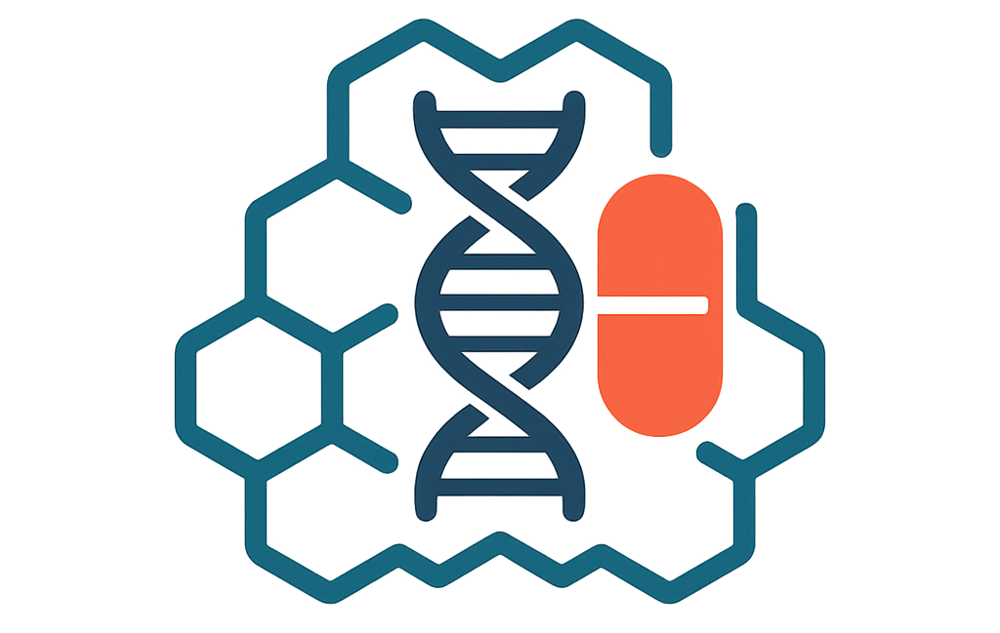

<h1 align="center">
<h3>AbxSimU-AI: Similarity-Based Undersampling and AI Models for Antibiotic Activity Prediction </h3>
</h1>
<p align="center">

</p>

## Source Data

The dataset of current study comprises three distinct libraries of compounds, adopted from a former study (https://www.nature.com/articles/s42256-024-00809-7). 

 - **Library 1** consists of 2371 internationally approved drug compounds from the Pharmakon-1760 library and 800 natural compounds isolated from plant, animal, and microbial sources. Pharmakon-1760 is a curated chemical library developed by MicroSource Discovery Systems, containing 1360 Food and Drug Administration (FDA)-approved drugs and 400 internationally approved drugs. This library is widely used in high-throughput drug screening and drug repurposing studies due to its inclusion of clinically relevant molecules with diverse biological activities.
 - **Library 2**, known as the Broad Drug Repurposing Hub, contains 6680 molecules, many of which are FDA-approved drugs or candidates currently undergoing clinical trials. 
 - **Library 3** is a synthetic small-molecule screening collection comprising 5376 molecules randomly sampled from a larger chemical library maintained at the Broad Institute. All three libraries were screened for their growth inhibitory activities against an opportunistic bacteria, namely - *Acinetobacter baumannii*, primarily associated with hospital-acquired infections and resistance. The activities were categorized as active (1) or inactive (0), constituting a binary classification problem.

In our research, we compared two modeling strategies: (1) Combined libraries approach, where Libraries 1, 2, and 3 were merged prior to data splitting; and (2) a Library partitioning approach, in which Libraries 1 and 2 were used exclusively for training, and Library 3 was reserved for independent testing. The example data is in the `data` file.

### Data schema

CSV columns (required):
+ `smiles` (string)
+ `antibiotic_activity` (binary; `1` = positive, `0` = negative)

Make sure input is clean and SMILES are valid; invalid SMILES are skipped (reported).

## Antibiotic Activity ML Benchmarks & GNN Pipeline

This repository contains two complementary pipelines for molecular antibiotic-activity prediction:

1. **Classical ML (fingerprints)**

    + Morgan fingerprints (RDKit)
    + Model zoo: Logistic Regression, SVM, Random Forest, Decision Tree, KNN, XGBoost
    + Undersampling strategies: `kmeans` KMeans-based representative negative selection (train & test)
    + Rigorous evaluation with per-fold metrics + mean±sd tables
    + Hyperparameter search via 'GridSearchCV' (ROC-AUC as inner-CV metric)

2. **GNN with Graph Autoencoder (GAE) & GINE classifier**

    + RDKit → rich molecular graphs (node/edge features)
    + Graph Autoencoder (node reconstruction) → graph embeddings
    + Embedding-space undersampling of negatives by similarity to the positive centroid
    + GINE-based classifier with stratified 5-fold CV
    + Optional explainability: Integrated Gradients per graph, global feature importance, highlighted atom/bond PNGs

## Environment & Installation

**Recommended (conda):**

```
conda create -n abx-ml python=3.10 -y
conda activate abx-ml

# Core scientific stack
conda install -c conda-forge rdkit xgboost scikit-learn pandas numpy tqdm -y
```
**PyTorch & PyG (choose versions matching your CUDA / OS):**

+ Install PyTorch from the official instructions for your CUDA/CPU.
+ Then install PyTorch Geometric packages matching your PyTorch build.


## Classical ML (fingerprints)


Main multi-strategy benchmark

**Script:** `ml_benchmark.py`

**What it does:** Runs **four** strategies end-to-end and exports per-fold results, and best hyperparameters

+ `kmeans`: K-Means undersampling  (train & test)

+ `none`: no undersampling

+ `random`: random undersampling (train & test)


**Run:**

```python
python ml_benchmark.py \
  --data_csv ./data/raw_data.csv \
  --out_dir ./ml_outputs \
  --splits 5 \
  --inner_cv 5 \
  --neg_pos_ratio 2.0 \
  --balanced_repeats 10 
```


## GNN Classifier

**Script:** `train_gcn_gae_pipeline.py`


1. **RDKit graphs** with rich node/edge features
2. **Graph Autoencoder (GAE)** to reconstruct node features → yields **graph embeddings**
3. **Negative undersampling in embedding space** relative to the positive centroid
   + `--pick nearest` (default): choose most similar negatives
   + `--metric cosine` (default) or `euclidean`
   + `--ratio 1.0` (negative:positive ≈ 1:1, configurable)
4. **GINE classifier** with stratified 5-fold CV (pos_weight in BCE for imbalance)
5. **Metrics:** `ROC-AUC`, `PRC-AUC`, `Accuracy`, `F1`, `MCC`, `Recall`, `Precision`, `False Positives`, `False Positive Rate`
6. **Explain ability (optional):** Integrated Gradients, per-molecule PNGs, global feature importance

**Run (train only):**

```
python train_gcn_gae_pipeline.py \
  --csv ./data/raw_data.csv \
  --pick nearest \
  --metric cosine \
  --ratio 1.0
```

**Run with explainability (save top-N visualizations & CSVs):**

```
python train_gcn_gae_pipeline.py \
  --csv ./data/raw_data.csv \
  --pick nearest --metric cosine --ratio 1.0 \
  --explain 5 \
  --explain-steps 64 \
  --explain-save-dir ./explain_out
```

## Citation

```
@article{DU2026108778,
  title = {Ligand-based prediction of anti-bacterial compounds: Overcoming class imbalance in molecular data},
  journal = {Computational Biology and Chemistry},
  volume = {120},
  pages = {108778},
  year = {2026},
  issn = {1476-9271},
  doi = {https://doi.org/10.1016/j.compbiolchem.2025.108778},
  url = {https://www.sciencedirect.com/science/article/pii/S1476927125004402},
  author = {Yiheng Du and Khandaker Asif Ahmed and Himadri Shekhar Mondal and Md Zakir Hossain}
}
```


